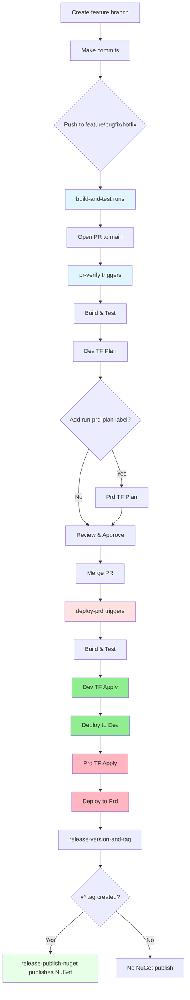

<em>Target: Senior engineers working on portal-servers-integration. Covers branch strategy, CI/CD triggers, nuget publishing, and typical development flows.</em>

# Development Workflows

## Branch Strategy & Triggers

### Feature Development (feature/*, bugfix/*, hotfix/*)
- **build-and-test.yml**: Runs on push to feature/bugfix/hotfix branches
  - Build and test via `dotnet-ci` composite action (multi-targets .NET 9 and 10)
  - No deployments
  - Purpose: Fast feedback loop for WIP changes

### Pull Requests → main
- **pr-verify.yml**: Validation pipeline (runs on PR open, updates, reopen, and ready for review)
  - Build and test
  - Terraform plan for dev (skips for dependabot and copilot/* unless labeled)
  - Terraform plan for prd (requires `run-prd-plan` label; copilot branches also require `run-dev-plan`)
  - Concurrency groups prevent parallel dev/prd operations

### Main Branch (on merge)
- **deploy-prd.yml**: Promotion pipeline
  - Build → Deploy Dev → Deploy Prd
  - Uses `terraform-plan-and-apply` composite action
  - Triggers: push to `main`, weekly schedule (Thu 3am UTC), manual dispatch
  - Workflow-level concurrency serializes runs

### Scheduled & On-Demand
- **codequality.yml**: Weekly Monday 3am UTC + on PR/push to main
  - SonarCloud analysis
- **deploy-dev.yml**: Manual dispatch
  - Refresh dev environment without merging to main
- **copilot-setup-steps.yml**: Validates agent setup on workflow changes; manual dispatch available
- **devops-secure-scanning.yml**: Weekly Thursday 2am UTC + PR/push to main; uploads SARIF results

### NuGet Packaging
- **release-version-and-tag.yml**: Calculates semantic version with Nerdbank.GitVersioning on push to `main` (src changes) or manual dispatch; optionally tags release commits
- **release-publish-nuget.yml**: Runs after successful tagging workflow; publishes `nuget-packages` artifact to NuGet.org and creates GitHub release when a `v*` tag is present

## Standard Developer Flow

### Local Development
```bash
# Standard validation sequence
dotnet clean src/XtremeIdiots.Portal.Integrations.Servers.Api.V1/XtremeIdiots.Portal.Integrations.Servers.Api.V1.csproj
dotnet build src/XtremeIdiots.Portal.Integrations.Servers.Api.V1/XtremeIdiots.Portal.Integrations.Servers.Api.V1.csproj
dotnet test src --filter "FullyQualifiedName!~IntegrationTests"
```

### Feature Branch → PR → Merge Flow



## Copilot Agent Flow

- Copilot branches (`copilot/*`) skip Terraform plans by default in **pr-verify.yml**
- Add `run-dev-plan` label to enable the dev plan; add both `run-dev-plan` and `run-prd-plan` to run the prd plan
- Setup requirements are defined in **copilot-setup-steps.yml** (checkout + .NET 9.0.x)

## Composite Actions (frasermolyneux/actions)

- **dotnet-web-ci**: Build, test, publish API artifact
- **terraform-plan** / **terraform-plan-and-apply**: Init, plan, and optionally apply
- **deploy-app-service**: Deploy web/API app to Azure App Service
- **dotnet-ci** and **publish-nuget-packages**: Used by NuGet tag/publish flow

## Quick Reference

| Scenario                | Workflow                | Trigger                  | Terraform     | Deploy  | NuGet        |
| ----------------------- | ----------------------- | ------------------------ | ------------- | ------- | ------------ |
| Feature commit          | build-and-test          | Push to feature/bugfix   | ❌             | ❌       | ❌            |
| PR validation           | pr-verify               | PR to main               | Dev plan      | ❌       | ❌            |
| Merge to main           | deploy-prd              | Push to main             | Dev+Prd apply | Dev+Prd | ❌            |
| Manual dev refresh      | deploy-dev              | Manual dispatch          | Dev apply     | Dev     | ❌            |
| Code quality            | codequality             | Monday 3am UTC + PR/push | ❌             | ❌       | ❌            |
| Security scanning       | devops-secure-scanning  | Thursday 2am UTC + PR    | ❌             | ❌       | ❌            |
| Version/tag calculation | release-version-and-tag | Push to main (src)       | ❌             | ❌       | Prepares tag |
| Publish NuGet release   | release-publish-nuget   | After successful tagging | ❌             | ❌       | ✅            |

## Environment Secrets

OIDC authentication uses GitHub environment variables (not secrets):
- `AZURE_CLIENT_ID`: Service principal app ID
- `AZURE_TENANT_ID`: Azure AD tenant
- `AZURE_SUBSCRIPTION_ID`: Target subscription

Defined in **Development**, **Production**, and **NuGet** environments within GitHub repository settings.